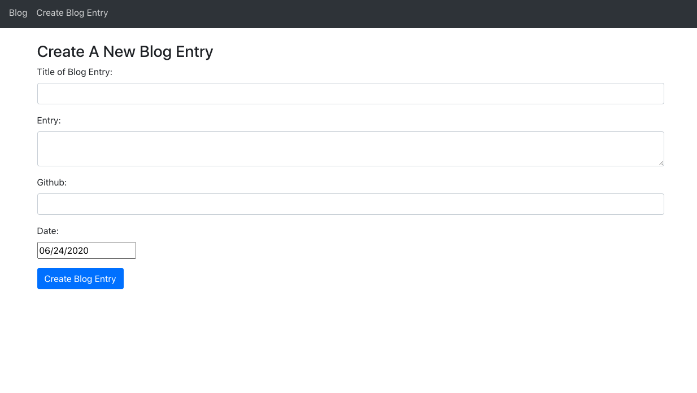

# _Blog Applicaton - MERN Stack_

  

#### _This is an application for making a blog._

#### By _**Josh Forman**_

## Description

_This application allows the users full CRUD of blog entries including title, date, content, and github link. This was built as a MERN Stack application, so includes a frontend application as well as a backend and database on MongoDB._

_https://github.com/JPForman/MERN-Blog_

## Setup/Installation Requirements

* _$ git clone https://github.com/JPForman/MERN-Blog_

* _$ cd MERN-Blog_

* _$ npm install_

* _$ npm run start (browser will open to localhost:3000)_  

* _change to directory MERN-Blog/backend_  

* _$ nodemond server (server will open to localhost:5000)_  

## Routes

'/' -- View complete blogs  
'/create' -- Create blog entry  
'/edit/:id' -- Edit Selected blog entry  
  

## Endpoints
get http://localhost:5000/blogEntries  -- returns all blogs  
get http://localhost:5000/blogEntries/:id -- returns blog entry by id  
delete http://localhost:5000/blogEntries/:id -- deletes blog entry by id  
post http://localhost:5000/blogEntries/add  -- adds a blog entry  
post http://localhost:5000/blogEntries/update/:id  -- update a blog entry event  

## Specs

* _The application allows the user to view, update, and create blog entries._

## Known Bugs

_Readme Endpoints need updating_  
_Needs Styling_

## Support and contact details

_Any questions, comments or contributions please contact Josh Forman (cyborgforman@gmail.com)_

## Technologies Used

_React, MongoDB, Express, Node.js, Bootstrap, Axios_

## Resources  
 Special thanks to the tutorial at https://www.youtube.com/watch?v=7CqJlxBYj-M&t=618s  

### License

*The MIT License

Permission is hereby granted, free of charge, to any person obtaining a copy
of this software and associated documentation files (the "Software"), to deal
in the Software without restriction, including without limitation the rights
to use, copy, modify, merge, publish, distribute, sublicense, and/or sell
copies of the Software, and to permit persons to whom the Software is
furnished to do so, subject to the following conditions:

The above copyright notice and this permission notice shall be included in
all copies or substantial portions of the Software.

THE SOFTWARE IS PROVIDED "AS IS", WITHOUT WARRANTY OF ANY KIND, EXPRESS OR
IMPLIED, INCLUDING BUT NOT LIMITED TO THE WARRANTIES OF MERCHANTABILITY,
FITNESS FOR A PARTICULAR PURPOSE AND NONINFRINGEMENT. IN NO EVENT SHALL THE
AUTHORS OR COPYRIGHT HOLDERS BE LIABLE FOR ANY CLAIM, DAMAGES OR OTHER
LIABILITY, WHETHER IN AN ACTION OF CONTRACT, TORT OR OTHERWISE, ARISING FROM,
OUT OF OR IN CONNECTION WITH THE SOFTWARE OR THE USE OR OTHER DEALINGS IN
THE SOFTWARE.*

Copyright (c) 2020 **_Josh Forman_**